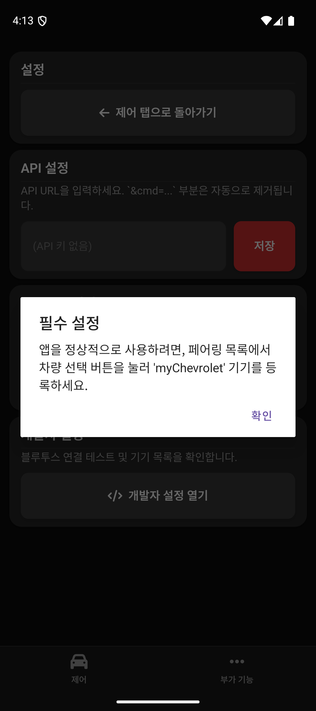

# My Traverse - Car Control App

**A Smart Remote Control & Driving Companion App for Chevrolet Owners**

  

`My Traverse`는 쉐보레(Chevrolet) 차량을 스마트폰으로 제어하고, 주행 기록을 자동으로 관리해주는 안드로이드 애플리케이션입니다. 블랙 & 오렌지의 세련된 다크 테마 UI를 제공하며, 블루투스 연결을 통해 차량 탑승을 감지하고 스마트한 기능을 수행합니다.

## 📱 Screenshots (스크린샷)

| **Parking Mode (주차 상태)** | **Driving Mode (주행 상태)** |
|:---:|:---:|
|  |  |
| **차량 상태 및 주차 위치 확인** 마지막 주차 시간, 위치(주소) 표시 | **실시간 주행 정보** 주행 시간, 거리, 속도 실시간 모니터링 |

---

## 🚀 Key Features (주요 기능)

### 1. Smart Driving Mode (스마트 주행 감지)
*   **Auto Detection**: 차량의 블루투스('myChevrolet')에 연결되면 자동으로 **주행 모드**로 전환됩니다.
*   **Live Dashboard**: 운전 중 스마트폰 화면을 통해 **주행 시간, 거리, 현재 속도**를 큼직한 UI로 확인할 수 있습니다.
*   **Background Tracking**: 앱을 내려놓아도 백그라운드 서비스가 끊김 없이 주행 데이터를 안전하게 기록합니다.

### 2. Auto Parking Location (주차 위치 자동 저장)
*   **Never Lose Your Car**: 시동을 끄고 차량에서 내리면(=블루투스 해제), 그 즉시 **현재 위치와 시간을 자동으로 저장**합니다.
*   **Address Conversion**: GPS 좌표를 자동으로 도로명 주소로 변환하여 보여주므로, 나중에 차를 어디에 댔는지 지도를 켤 필요 없이 바로 알 수 있습니다.

### 3. Remote Control (원격 제어)
차량과 연동된 API 서버를 통해 어디서든 내 차를 제어할 수 있습니다.
*   **Basic**: 문 잠금/열림, 비상등, 경적.
*   **Smart Macro**:
    *   **Ventilation (환기)**: 창문을 모두 열고 일정 시간 후 자동으로 닫아 차량 내부 공기를 순환시킵니다.
    *   **Heat Eject (열 배출)**: 여름철 뜨거운 열기를 빼내기 위한 최적화된 매크로 동작을 수행합니다.

### 4. Driving History (주행 이력)
*   과거의 모든 주행 기록(날짜, 시간, 출발지, 도착지, 평균 속도, 최고 속도)이 자동으로 로그에 저장되며, 앱 내에서 카드 형태로 깔끔하게 조회할 수 있습니다.

---

## 🛠 Tech Stack

*   **Native Android**: Kotlin (Activity, Service, BroadcastReceiver, LocationManager)
*   **UI Engine**: WebView (HTML5, CSS3, JavaScript)
*   **Communication**: Bluetooth Profile Proxy (A2DP, Headset), HTTP(S) API connection
*   **Persistence**: SharedPreferences, JSON File I/O

---

## 📥 How to Use

1.  **초기 설정**:
    *   앱 실행 후 **권한(위치, 블루투스, 알림)**을 모두 허용합니다.
    *   **Settings** 탭에서 **'Select Car'**를 눌러 내 차의 블루투스를 등록합니다.
    *   원격 제어를 위한 **API URL**을 입력합니다.
2.  **주행**:
    *   차에 타면 자동으로 주행 모드가 켜집니다.
    *   내리면 자동으로 주차 위치가 저장됩니다.
3.  **제어**:
    *   메인 화면의 **Controls** 탭에서 원하는 기능을 터치하여 실행합니다.

---

## 🔒 Security Note
*   이 프로젝트는 개인적인 학습 및 사용 목적으로 제작되었습니다.
*   `local.properties` 등 민감한 정보는 공개 저장소에 포함되지 않습니다.
